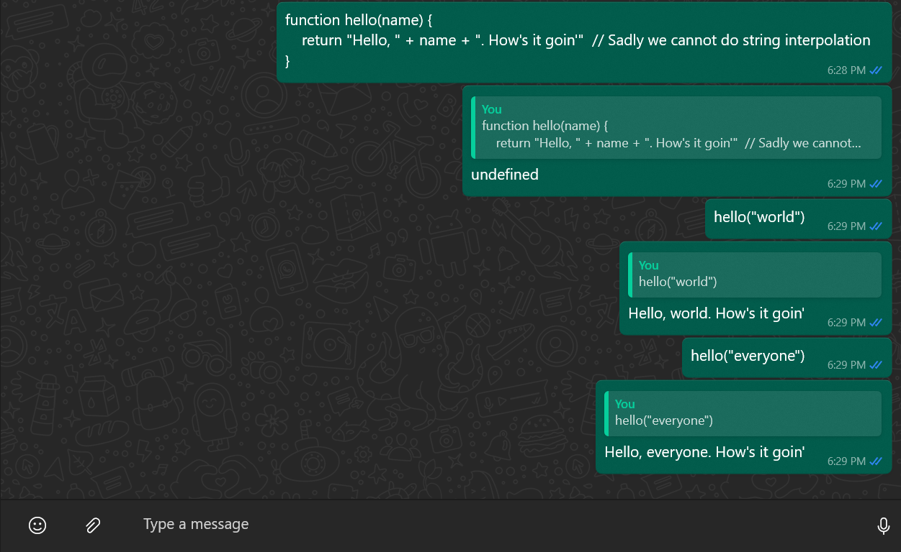
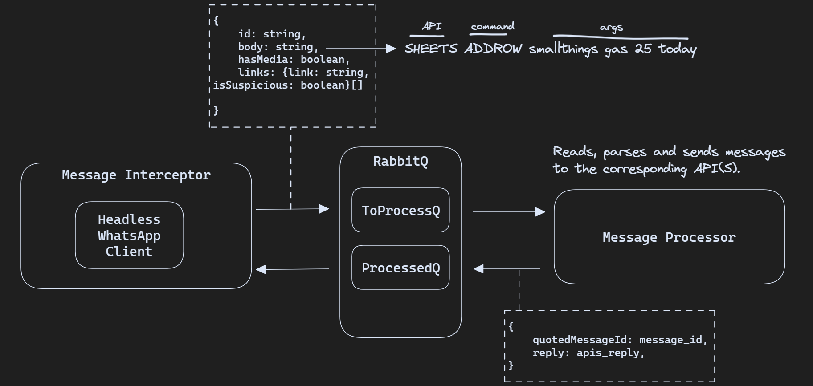

# How I turned my WhatsApp chat into an API wrapper
<date>December 13, 2023</date>

Day to day, I find myself taking notes and saving images using my own WhatsApp chat.
The main reason being that this way I have a quick note-taking app in my phone that I can also
keep open in my PC.

One could argue that there's already apps made exactly for this use case, and while that is true,
those tend to cause friction in already stablished workflows.

That is, I don't want to install another app. I dont want to create another account, I dont want to have yet another process and window running in my computer. And most important, I don't want to pay a subscription to unlock features behind a premium tier.

At this point, WhatsApp has become such an important app that I open it almost as a reflex when I need to
write something down. It already gives me a sandbox to write whatever I want in whatever format I need.
Why not expand it?

## Proof Of concept
To "expand" something is a very broad term and would depend on different needs. However,
we can set some bases up and leave the specific stuff for later.

WhatsApp doesn't offer a public API, understandably so. There's a bussiness API but I wanted to keep
things simple and cheap as possible, so I went with `whatsapp-web.js`, a client that connects to
WhatsApp Web through a headless browser and let us listen to and send messages.

The set up and login code its pretty simple so I'm going to jump straight to what we need.
Here's how we can listen and filter messages, and read the body content of the messages:
    
```js
waClient.on('message_create', m => {
    // Check if message is on self-chat
    if (m.from !== m.to)
        return;

    // Check if message was sent from bot
    if (!m.author)
        return;

    // Set chat ID if not already set
    // This is used to send messages later
    if (!SELF_CHAT_ID)
        m.getChat().then(c => {
            SELF_CHAT_ID = c.id._serialized;
        })

    console.log({ id: m.id._serialized, body: m.body })
})
```

We can also send messages and even quote previous messages to respond to them individually:
```js
waClient.sendMessage(
    SELF_CHAT_ID,
    'Hello, I\'m answering',
    { quotedMessageId }
)
```
As you probably imagine, this is 50% of the idea. With this we can already implement some toy _commands_. For example,
here's and implementation of a `coinflip` and `dice` _commands_:

```js
waClient.on('message_create', m => {
    // ... same checks as before

    if (m.body.strip().toLowerCase() === 'dice') {
        const res = String(Math.floor(Math.random() * 6) + 1)
        waClient.sendMessage(SELF_CHAT_ID, res, m.id._serialized)
        return;
    }

    if (m.body.strip().toLowerCase() === 'coinflip') {
        const res = res = Math.random() > 0.5 ? 'Heads' : 'Tails'
        waClient.sendMessage(SELF_CHAT_ID, res, m.id._serialized)
        return;
    }
})
```

And more interestingly, we can turn our chat into a Node REPL:
```js
// We need this to have eval() "remember" context
var __EVAL = s => eval(`void (__EVAL = ${__EVAL.toString()}); ${s}`);

waClient.on('message_create', m => {
    // ... same checks as before

    let res;
    try {
        res = __EVAL(code);
    } catch(err) {
        res = err.message;
    }
    waClient.sendMessage(SELF_CHAT_ID, res, m.id._serialized)
})
```
...which let us do:


As you can see, once we have access to our messages from a programming environment, creating new _commands_ and interpreting
them to put information out using with other APIs - think of putting a row in Google Sheets, creating a Trello ticket,
uploading a file to Google Drive - is a matter of connecting those APIs.

The limit is whatever is codeable.

If we want to get fancy, we can justify queuing the pending _commands_ and the resolved ones to get system that looks
like this:



## CI/CD
As I'm learning Cloud and DevOps practices, I tried to come up with a CI/CD pipeline using AWS services only. This section
shortly describres the final shape of it and the problems I faced.
	

## Final words
I had a lot of fun with this project, and although I'm not actively using it for now, I do think it could have its value
in a niche use case that I'm yet to see. Here is the link to the repo if you want to take a look. url
	